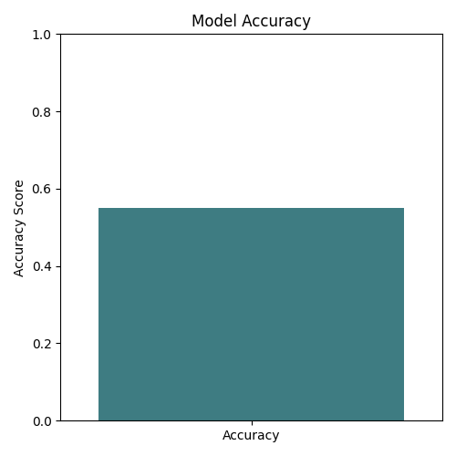
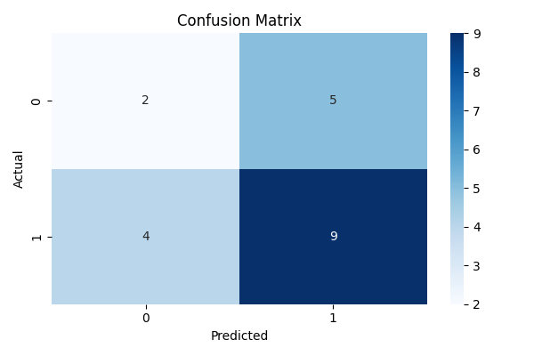
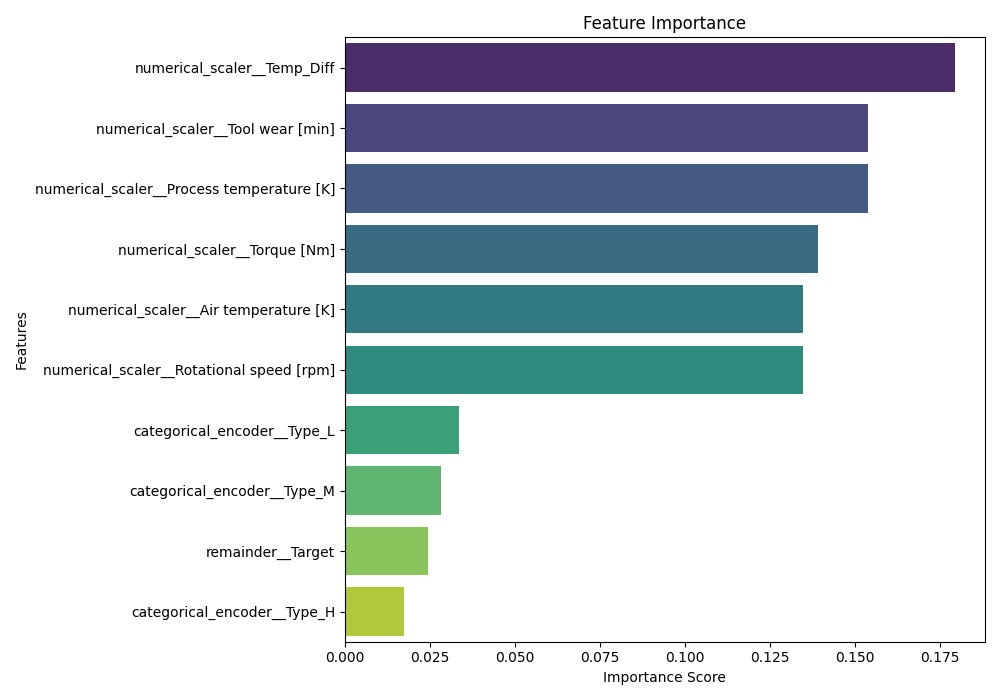

<div align="center">

# 🛠️⚙️ Predictive Maintenance using Machine Learning  
### **A Production-Ready ML Pipeline for Equipment Failure Prediction**

<br>


<br><br>

✨ **AI-powered system that predicts machine failures using real sensor data.**  
Automatically preprocesses data, trains a RandomForest model, evaluates performance,  
and provides visual insights + an interactive prediction app.

</div>

---

## 🚀 **Features**
✔ End-to-End ML Pipeline (Preprocessing → Training → Evaluation → Export)  
✔ Handles missing values & outliers  
✔ One-Hot Encoding + Scaling with ColumnTransformer  
✔ RandomForestClassifier with feature importance  
✔ Exports trained model + preprocessor (joblib)  
✔ Auto-generated model performance plots  
✔ Ready-to-run Streamlit Web App

---

## 📁 **Project Structure**
 ```
Predictive-Maintenance-ML/
│
├── data/
│   └── sensor_data.csv
│
├── model/
│   ├── best_model.joblib
│   ├── preprocessor.joblib
│   └── train_model.py
│
├── static/
│   └── screenshots/
│         ├── accuracy_graph.png
│         ├── confusion_matrix.png
│         └── feature_importance.png
│
├── app/
│   └── app.py
│
└── README.md
```


---

## 📊 **Model Performance Visuals**

### 📈 Model Accuracy


### 🔎 Confusion Matrix


### 🌟 Feature Importance


---

## ⚙️ **How It Works (ML Pipeline)**

### **1️⃣ Data Preprocessing**
- Missing values filled  
- Outlier handling  
- Scaling numerical features  
- One-hot encoding categorical features  
- Automatic feature engineering (Temp Diff, etc.)

### **2️⃣ Model Training**
- RandomForestClassifier  
- Handles nonlinear relationships  
- Extracts top predictive features  

### **3️⃣ Model Export**
Outputs:


best_model.joblib
preprocessor.joblib


### **4️⃣ Visual Insights**
Automatically generated:

- Confusion Matrix  
- Feature Importance  
- Accuracy Plot  

---

## 📦 **Installation**

```bash
git clone https://github.com/yourusername/Predictive-Maintenance-ML.git
cd Predictive-Maintenance-ML
pip install -r requirements.txt

▶️ Run Training Script
cd model
python train_model.py

💻 Run the Streamlit App
cd app
streamlit run app.py

📜 Training Logs (Expand to View)
<details> <summary>Click to expand training output</summary>
Dummy DataFrame created with sample missing values and outliers.

--- Starting Data Preprocessing and Feature Engineering ---
Filled missing values in 'Air temperature [K]' with mean (302.59)
Filled missing values in 'Torque [Nm]' with mean (101.92)
Data preprocessing complete.

--- Starting Model Training ---
Training RandomForestClassifier...
Model training complete.

Feature Importances:
Temp_Diff               0.179
Tool wear               0.153
Process temperature     0.153
Torque                  0.139
Air temperature         0.134
Rotational speed        0.134
Type_L                  0.033
Type_M                  0.028
Target                  0.024
Type_H                  0.017

--- Exporting Trained Model ---
model saved to trained_model/best_model.joblib
preprocessor saved to trained_model/preprocessor.joblib

</details>
🧠 Tech Stack

Python

Scikit-Learn

Pandas

NumPy

Matplotlib / Seaborn

Streamlit

Joblib

🌟 Future Improvements

🔹 Deploy on cloud (Render / AWS / GCP)
🔹 Hyperparameter tuning
🔹 LSTM-based time-series forecasting
🔹 Real-time sensor data ingestion

<div align="center">
❤️ Like this project? Star ⭐ the repo!
Built with hard work & caffeine by Disha Chakraborty ☕✨
</div> ```
