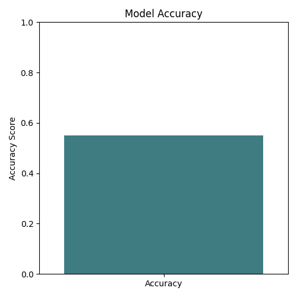
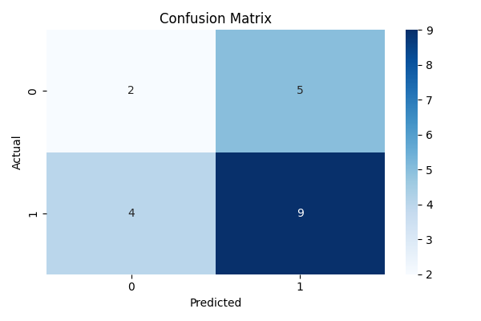
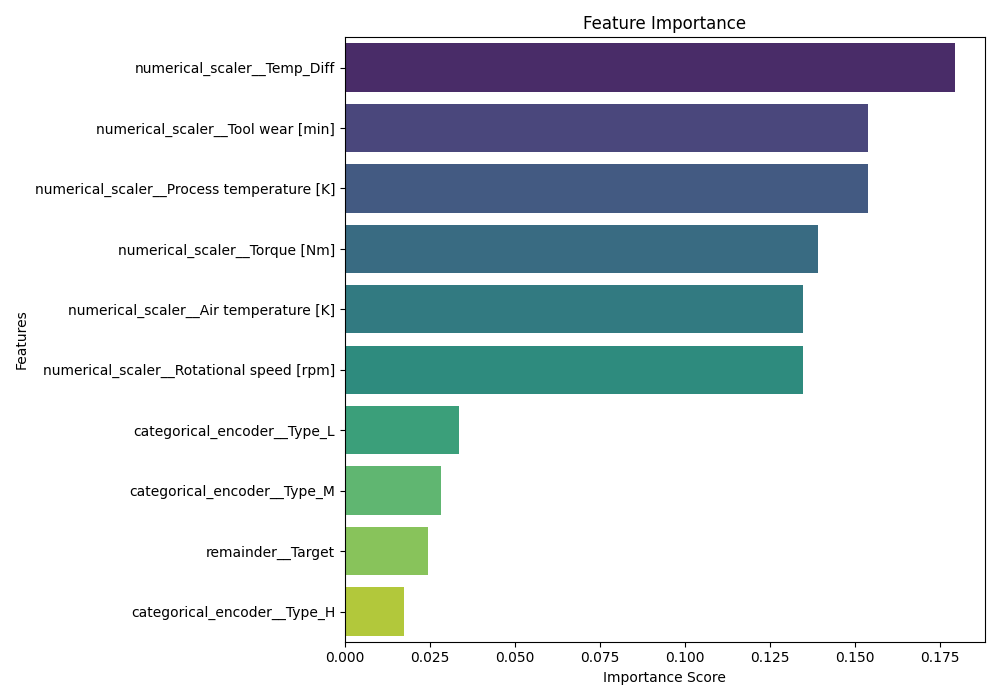

<div align="center">

# 🛠️⚙️ Predictive Maintenance using Machine Learning  
### **A Production-Ready ML Pipeline for Equipment Failure Prediction**

<br>


<br><br>

✨ **AI-powered system that predicts machine failures using real sensor data.**  
Automatically preprocesses data, trains a RandomForest model, evaluates performance,  
and provides visual insights + an interactive prediction app.

</div>

---

## 🚀 **Features**
✔ End-to-End ML Pipeline (Preprocessing → Training → Evaluation → Export)  
✔ Handles missing values & outliers  
✔ One-Hot Encoding + Scaling with ColumnTransformer  
✔ RandomForestClassifier with feature importance  
✔ Exports trained model + preprocessor (joblib)  
✔ Auto-generated model performance plots  
✔ Ready-to-run Streamlit Web App

---

## 📁 **Project Structure**
 ```
Predictive-Maintenance-ML/
│
├── data/
│   └── sensor_data.csv
│
├── model/
│   ├── best_model.joblib
│   ├── preprocessor.joblib
│   └── train_model.py
│
├── static/
│   └── screenshots/
│         ├── accuracy_graph.png
│         ├── confusion_matrix.png
│         └── feature_importance.png
│
├── app/
│   └── app.py
│
└── README.md
```


---

## 📊 **Model Performance Visuals**

### 📈 Model Accuracy


### 🔎 Confusion Matrix


### 🌟 Feature Importance


---

## ⚙️ **How It Works (ML Pipeline)**

### **1️⃣ Data Preprocessing**
- Missing values filled  
- Outlier handling  
- Scaling numerical features  
- One-hot encoding categorical features  
- Automatic feature engineering (Temp Diff, etc.)

### **2️⃣ Model Training**
- RandomForestClassifier  
- Handles nonlinear relationships  
- Extracts top predictive features  

### **3️⃣ Model Export**
Outputs:


best_model.joblib
preprocessor.joblib


### **4️⃣ Visual Insights**
Automatically generated:

- Confusion Matrix  
- Feature Importance  
- Accuracy Plot  


````
##Setup Instructions

### Installation

1. Clone the repository:
   ```bash
   git clone https://github.com/yourusername/Predictive-Maintenance-ML.git
````

2. Navigate to the project directory:

   ```bash
   cd Predictive-Maintenance-ML
   ```

3. Install the required dependencies:

   ```bash
   pip install -r requirements.txt
   ```

---

## ▶️ Run the Training Script

1. Move to the model directory:

   ```bash
   cd model
   ```

2. Execute the training script:

   ```bash
   python train_model.py
   ```

This step preprocesses the data, trains the machine learning model, and saves the trained model files.

---

## 💻 Run the Streamlit Application

1. Navigate to the app directory:

   ```bash
   cd app
   ```

2. Launch the Streamlit app:

   ```bash
   streamlit run app.py
   ```

3. Open the local URL displayed in the terminal to interact with the application.

---

## 📜 Training Output

<details>
<summary>Click to view sample output</summary>

* Missing values are handled automatically
* The model is trained using RandomForest
* Feature importance and evaluation results are displayed
* Trained model files are saved for reuse

</details>

---

## 🧠 Technology Stack

* Python
* Scikit-learn
* Pandas
* NumPy
* Matplotlib
* Streamlit

---

## 🌟 Future Improvements

* Cloud deployment (AWS / GCP / Render)
* Model optimization and hyperparameter tuning
* Time-series forecasting
* Real-time data integration

---

<div align="center">
⭐ If you find this project useful, consider starring the repository  
Developed by Disha Chakraborty
</div>
```


